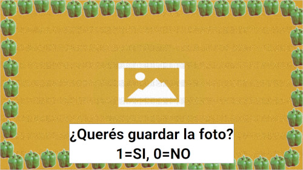

## Description
This is a photobooth. It works on a Raspberry Pi 3, with a Camera Module. It was present as an attraction at the week of Computer Science (scientific divulgation for high school students) of my University. The idea is that the visitors could take a souvenir photo. After taking the picture, it puts a frame around it, and uploads it to a web server. Then, it shows a QRCODE with the URL.

### Captures


## Requirements:
* Raspberry Pi 3 B with Raspbian and Camera Module.
* Python3 + pip
* Use requirements-frozen.txt file with pip
* Rsync if you want to sync to web server
* libatlas-base-dev libatlas-base

## Installation
Just install the requirements with pip.
```
pip install -r requirements-frozen.txt
```
It can be tested without a raspberry. There is a try in the `import picamera` instruction, so if we are running from a computer, it activates the MOCK_MODE in photobooth.py, and also loads the `mock_picamera` or the `cv2_picamera` module as an alias of picamera module in camera.py.

## How to use
Just run the photobooth `python3 photobooth.py`.

The photobooth should to be next to a poster with the instructions. Something like the next:
1. Press Enter.
2. Pose for the photo, and wait the 5 seconds countdown.
3. The software is going to show a preview of the photo. 
4. Press 1 if you like it, or 0 if you don't.
5. If you press 1, the photo will be uploaded.
6. After the uploading succeded, scan the QR code with your cellphone!
7. Press 5 in any moment to restart.

## Links:
- https://projects.raspberrypi.org/en/projects/the-all-seeing-pi/9
- https://solarianprogrammer.com/2018/04/21/python-opencv-show-video-tkinter-window/
